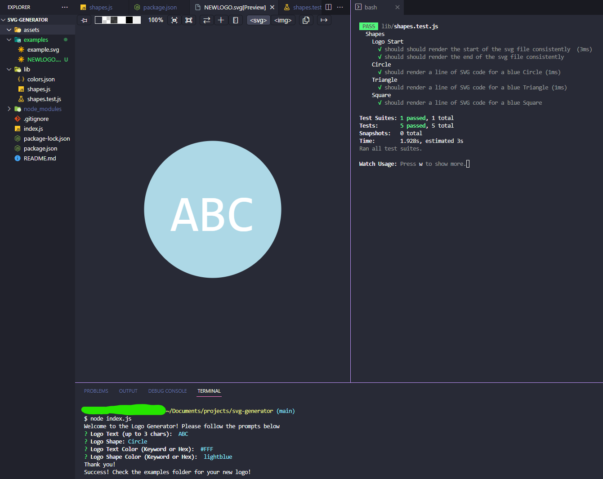

# SVG Generator
## Description

[Video Walkthrough](https://drive.google.com/file/d/1YSK3QQyO2Fcfa1hFWRRcX_UiPFDclTC_/view)

This is a SVG generator designed by Yoon-Jae Kim. The purpose of this program is to generate a quick, professional logo using the CLI. After running 'node index.js', the user will be put through a series of prompts using the inquirer module. After answering each question, a new SVG logo will be created in the examples directory.

The utility has exception tests built in to each class to ensure that the correct the text length of the logo (1-3 char) is correct and that the colors are either input as a CSS keyword or as a hexadecimal color code. The keywords are stored in a colors.json file which is imported into each .js file. 

Methods used here were learned from NW Coding Bootcamp.

## Table of Contents
- [Installation](#installation)
- [Usage](#usage)
- [Credits](#credits)
- [License](#license)
- [How to Contribute](#how-to-contribute)
- [Tests](#tests)

## Installation
Clone the repo into your local machine, then run 'node index.js'. Make sure that node is already installed before running the command in your CLI.

## Usage
This project can be used by anyone looking to streamline their README creation process.

## Credits
### Github
[Yoonbacca](https://github.com/Yoonbacca)
### Email
[yoonjaekim3@gmail.com](yoonjaekim3@gmail.com)

## License
None

## How to Contribute
This is a solo project and does not require contributions at this time.

## Tests
You can test this program after following the installation instructions above. This project contains a shapes.test.js file in the lib directory. Users can use the 'npm test' command to run the jest module in realtime to ensure any changes made will pass MVP requirements.
  